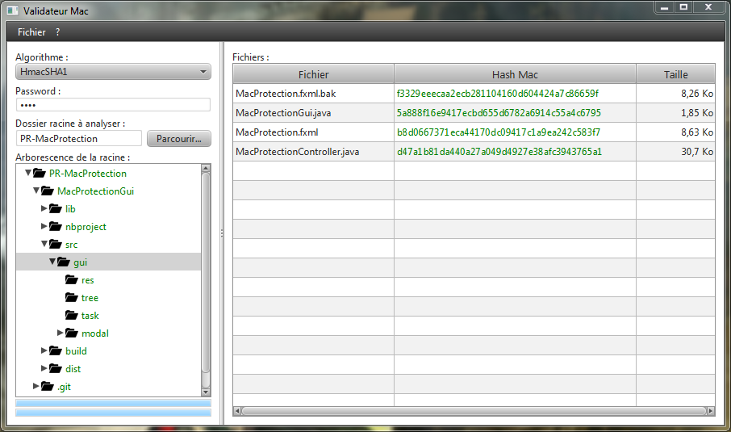

# PR-MacProtection

Protection of files and folders by MAC (Message Authentification Code).

Security and Cryptography project (ENSISA 2A IR) developped by [Karl Woditsch](https://github.com/Rauks) & [Georges Olivarès](https://github.com/Thiktak).

Detailed information are readable in the [project report](report.docx) (french).

## Core architecture (MacProtection)

## Graphic user interface (MacProtectionGui)

MacProtectionGui is a graphical interface to use MacProtection.

## Console user interface (MacProtectionCui)

MacProtectionCui is a console interface to use MacProtection. There is two common ways to use the console interface.

### First : -java -jar
Usable directly with `java -jar` command.

Example :

    # -java -jar MacProtectionCui.jar <command> [<arguments>]
    
    -java -jar MacProtectionCui.jar algos
    -java -jar MacProtectionCui.jar export -p password -a HmacMD5 -f check.save -s directoryToScan

### Second : cryo
Usable within a _bash_ executable, see package `cui.examples` for it.

Example :

    # cryo
    
    cryo algos
    cryo export -p password -a HmacMD5 -f check.save -s directoryToScan
	
### List of commands
* __algos__ 	List all algorithms
* __show__		Show informations about the folder (state, checksum, ...)
* __diff__		Show changes between source directory and checkfile
* __export__	Export checkfile of source folder
* __help__ 		Get help on a specific <command> or list all commands
